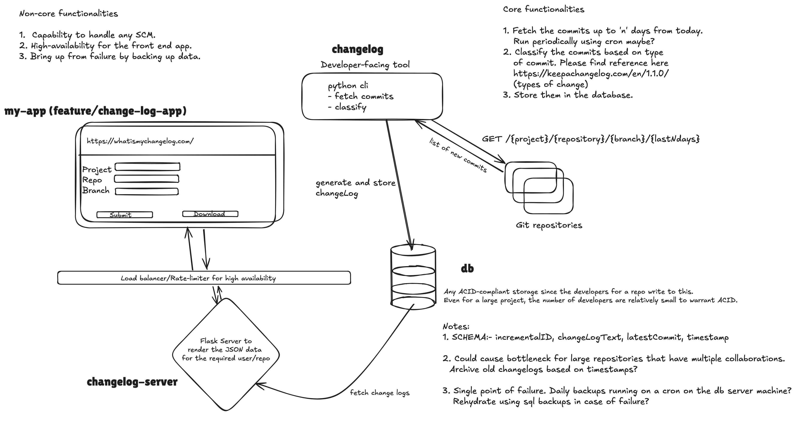
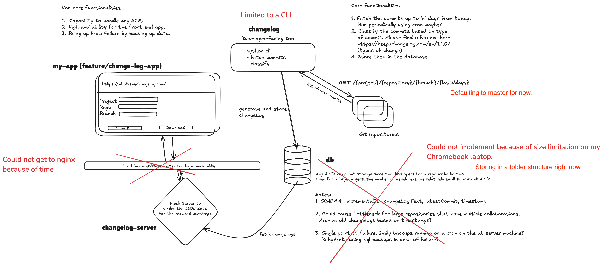

This was the initial design and thought-process for the tool. 

Due to size and time restrictions, I was only able to get to the following. I have marked them.

I have also utilized a simple summarization algorithm to only extract commit messages of relevance. This would prove helpful if the developers tend to write rather verbose commit messages.

Please find the usage in the changelog.mp4 video folder. Note that the user facing app will be in my other repository which is https://github.com/adwaraka/my-app/tree/feature/change-log-app.